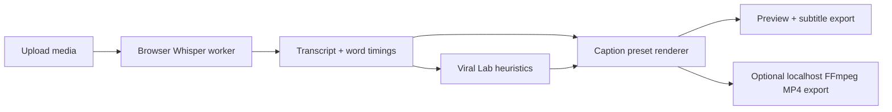

# Capshan

**Open-source, browser-first viral shorts editor for private AI captions.**

Capshan helps creators turn raw videos into TikTok/Reels/Shorts-ready clips with local Whisper transcription, word-by-word caption styles, hook analysis, safe-zone previews, subtitle exports, and optional local FFmpeg MP4 rendering.


## Why Capshan

Paid tools like Captions and VEED are polished, fast, and creator-native. Open-source caption tools are often private and useful, but not built around short-form virality. Capshan is designed to sit in that gap:

- No signup, no watermark, no lock-in.
- Browser-first workflow people can try instantly.
- Local Whisper transcription by default.
- Creator presets for Hormozi, Karaoke Fill, VEED Clean, Podcast Bold, Gamer, Minimal Pro, Education, Hindi/Urdu-friendly, and Meme styles.
- Viral Lab for hook scoring, cleanup cues, suggested platform, and one-click emphasis.
- Export subtitles as SRT, VTT, TXT, or render MP4 with the optional local helper.

## Current Feature Set

- Upload audio or video files.
- Choose transcription quality: Fast (`whisper-tiny.en`), Balanced (`whisper-base.en`), or Accurate (`whisper-small.en`).
- Edit transcript segments and word emphasis.
- Preview animated captions over the video.
- Switch platform formats: original, 9:16, 16:9, and 1:1.
- View safe-zone guides for formatted exports.
- Apply one-click viral formatting from the Viral Lab.
- Export subtitles locally.
- Export MP4 through the optional localhost FFmpeg server.

## Privacy Model

| Capability | Where it runs | Notes |
| --- | --- | --- |
| Upload/edit/preview | Browser | User media stays in the local browser session. |
| Transcription | Browser | Downloads the selected Whisper model from Hugging Face, then uses browser cache. |
| Subtitle export | Browser | SRT/VTT/TXT generated locally. |
| MP4 export | Local helper | Sends video to `http://localhost:3001`, not to a hosted cloud service. |
| Sample video | Remote demo asset | The sample button loads a public test video. |

## Quick Start

```bash
npm install
npm run dev
```

Open [http://localhost:5173](http://localhost:5173).

For MP4 export, start the optional local helper in a second terminal:

```bash
cd server
npm install
npm start
```

## Development

```bash
npm run lint
npm run build
```

The frontend is a Vite + React + TypeScript app. The optional export helper is an Express server that shells out to system FFmpeg.

## Architecture



## Roadmap

- Better model selector: browser tiny/base plus optional local faster-whisper or whisper.cpp helper.
- Shared preview/export renderer so every animation has exact export parity.
- Smart trimming for filler words, silence gaps, and jump-cut suggestions.
- Browser-native MP4 export via WebCodecs/canvas when stable enough.
- Desktop wrapper after the web app is polished, for offline batch workflows and faster local rendering.

## Contributing

Contributions are welcome. See [CONTRIBUTING.md](CONTRIBUTING.md) for setup, coding standards, and good first contribution areas.

## License

MIT. Use it personally, commercially, or as a base for your own creator tooling.
